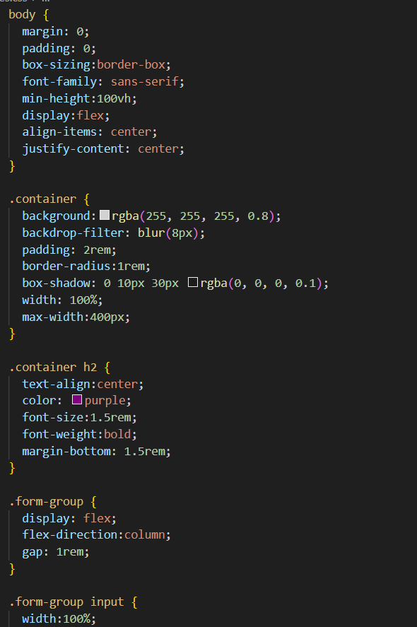

  # Student Registration Form with HTML5 Validation

## Aim

To design and implement a **Student Registration Form** using only HTML and HTML5 features to validate user input on the client side.

---

## Task Description

Create a basic student registration form using HTML. The form should collect the following user details:

- Name
- Email
- Age

### Requirements:
- Use `required` to ensure all fields must be filled.
- Use `type="email"` for validating email format.
- Use `type="number"` for validating numeric input.
- Restrict age input using `min="5"` and `max="100"`.

---

## Code

OUTPUT - 

Learning Outcomes
By completing this project, students will be able to:

1. Understand and apply HTML5 form elements
Learn how to build structured forms using <form>, <input>, and semantic HTML tags.

2. Implement client-side validation using HTML5 attributes
Use built-in validation features like required, type, min, and max to ensure correct user input without JavaScript.

3. Differentiate between input types
Gain familiarity with form input types such as text, email, and number, and understand how they help in user input validation.

4. Create user-friendly forms with accessible design
Understand how to build clean and simple forms that are intuitive for users to fill.

5. Apply basic CSS styling to enhance form appearance
Learn how to use CSS to style form elements, add spacing, colors, and make the form visually appealing.

6. Gain practical experience with front-end HTML5 development
Strengthen hands-on skills in web development by creating and testing a complete mini-project.

