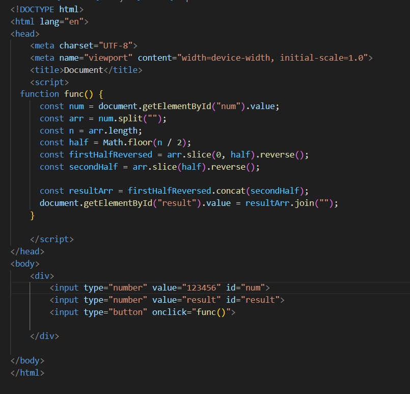
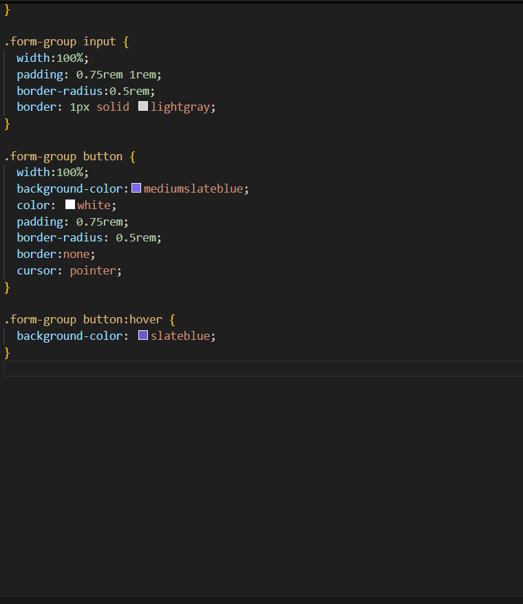
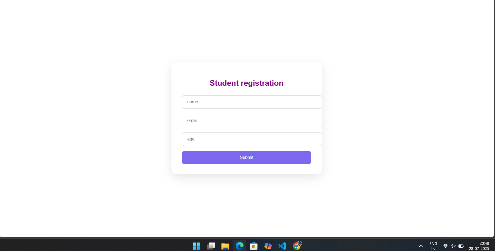
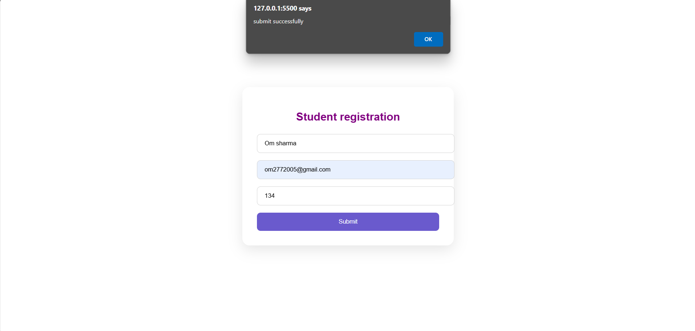

  # Student Registration Form with HTML5 Validation

## Aim

To design and implement a **Student Registration Form** using only HTML and HTML5 features to validate user input on the client side.

---

## Task Description

Create a basic student registration form using HTML. The form should collect the following user details:

- Name
- Email
- Age

### Requirements:
- Use `required` to ensure all fields must be filled.
- Use `type="email"` for validating email format.
- Use `type="number"` for validating numeric input.
- Restrict age input using `min="5"` and `max="100"`.

---

## Code

OUTPUT - 

